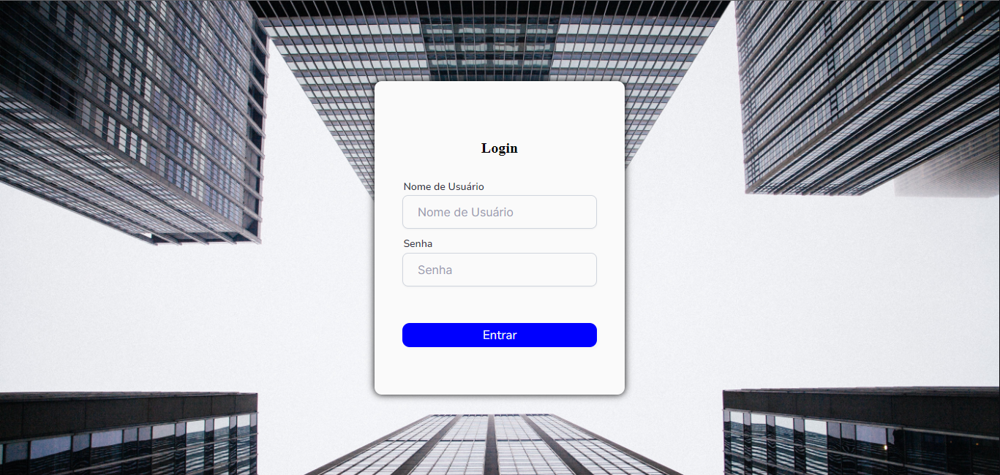
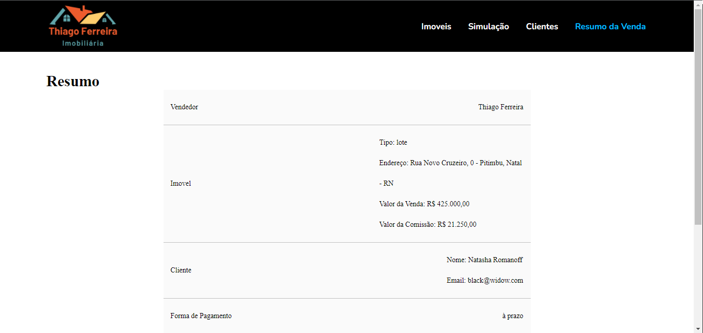
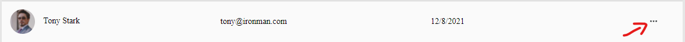
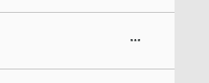
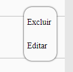
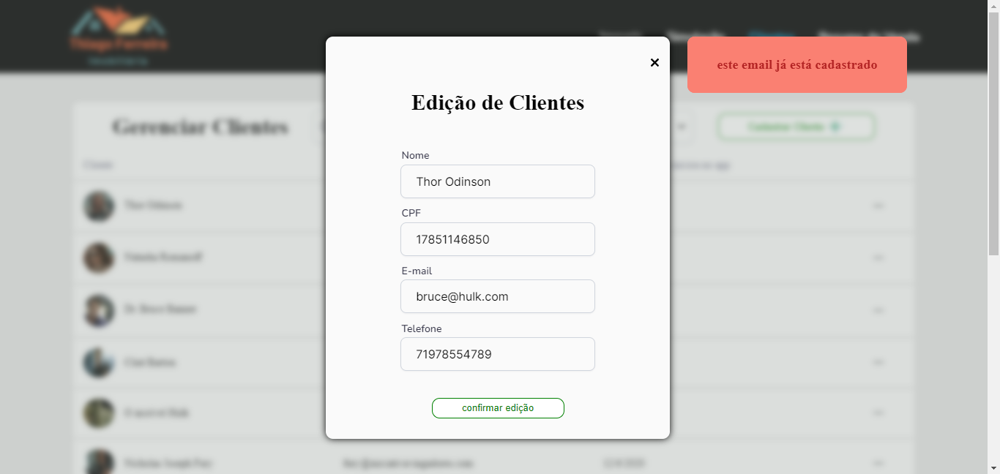
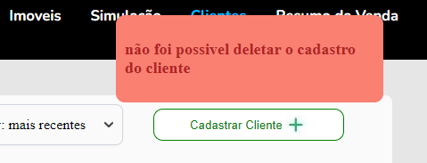

# Documentação Frontend - Desafio técnico Strategi:

## Sobre
- Esta é a documentação do frontend do desafio.

---

## O problema
Desenvolva uma pequena aplicação web de venda de imóveis onde um vendedor faz o login na aplicação, escolhe o imóvel(Apartamento ou Lote) na tela de seleção devem aparecer a localização do imóvel(endereço), valor de venda, valor de comissão do vendedor(5%) e qualquer outra informação que você queria colocar na tela, realiza a simulação de pagamento do imóvel (à vista ou 180 parcelas), escolhe o cliente que a venda será realizada e na tela final apresenta um resumo(extrato do financiamento) de toda a transação: Quem foi o vendedor, qual foi o imóvel, para quem foi vendido o imóvel e as condições de pagamento e extrato.

---

Tabela de conteúdos
=================
<!--ts-->
   * [Sobre](#sobre)
   * [O problema](#o-problema)
   * [Como usar](#como-usar)
   * [Pré Requisitos](#pr%C3%A9-requisitos)
   * [Rodando o projeto](#rodando-o-projeto)
   * [Login](#login)
   * [Imóveis](#im%C3%B3veis)
   * [Simulação de pagamento](#simula%C3%A7%C3%A3o-de-pagamento)
   * [Clientes](#clientes)
   * [Resumo](#resumo)
   * [CRUD de clientes](#crud-de-clientes)
      * [Cadastro de cliente](#cadastro-de-cliente)
      * [Edição de cliente](#edi%C3%A7%C3%A3o-de-cliente)
      * [Deletar cliente](#deletar-cliente)
   * [Tecnologias](#tecnologias)
   * [Autor](#autor)
<!--te-->

---

### Features

- [x] Login do usuário(corretor de imoveis).
- [x] Cadastro de Cliente.
- [x] Edição do cadastro de cliente.
- [x] Excluir cadastro do cliente.
- [x] Consultar clientes.
- [x] Consultar imóveis.
- [x] Cadastro de vendas.

--- 

# Como usar:

### Pré-requisitos


Antes de começar, você vai precisar ter instalado em sua máquina as seguintes ferramentas:
[Git](https://git-scm.com), [Node.js](https://nodejs.org/en/).
Além disto é bom ter um editor para trabalhar com o código como [VSCode](https://code.visualstudio.com/)

---

# login 

Ao acessar a aplicação você será direcionado para a página de login:

<h1 align="center">
  
</h1>

### Para acessar as outras páginas é necessário estar logado.

Ao tentar fazer login com dados inválidos aparecerão mensagens de erro como no exemplo abaixo e não conseguirá efetuar o login:

<h1 align="center">
  
</h1>

Após o login você será direcionado para a página de imoveis.

---

# Imóveis

A página de imoveis ira mostrar todos os imoveis cadastrados no banco de dados:

<h1 align="center">
  
</h1>

Cada card de imóvel irá mostrar as seguintes informações:
```
Foto do imóvel
Tipo: pode ser apartamento ou lote
Endereço: endereço do imóvel
Valor da venda: o valor de venda o imóvel
Valor da comissão: o valor de comissão para o vendedor(5% do valor do imóvel)
```

Ao clicar no imóvel que deseja vender você será direcionado para a página de simulação de pagamento.

---

# Simulação de pagamento

Na página de simulação de pagamento você poderá escolher entre as formas de pagamento:
À vista ou à prazo dividido em 180 parcelas.

<h1 align="center">
  
</h1>

Ao escolher a forma de pagamento e clicar em próximo você será direcionado para a página de clientes.

---

# Clientes

A página de clientes ira mostrar todos os clientes cadastrados no banco de dados:

<h1 align="center">
  
</h1>

Ao clicar no cliente escolhido para fazer a venda você será direcionado para o resumo da venda.

---

# Resumo

A página de resumo irá mostrar os dados da sua venda:

```
Nome do corretor logado (quem fará a venda).
Dados do imovel que foi escolhido na página de imoveis.
Dados do cliente que foi escolhido na página de clientes.
Forma de pagamento 
Total da venda
```

<h1 align="center">
  
</h1>
-
<h1 align="center">
  
</h1>

Ao clicar em finalizar venda, se tiver tudo certo com a venda, ela será cadastrada no banco de dados e aparecerá uma mensagem de sucesso:

<h1 align="center">
  
</h1>

E você será redirecionado para a página de imóveis.
Caso tenha algo de errado com a sua venda aparecerá uma mensagem de erro como por exemplo:

<h1 align="center">
  
</h1>

E a venda não será registrada no banco de dados.

---

# CRUD de clientes

## Cadastro de cliente

Na página de clientes, onde estão listados todos os clientes cadastrados no banco de dados:

<h1 align="center">
  
</h1>

Ao clicar em cadastrar cliente abrirá um modal de cadastro de clientes:

<h1 align="center">
  
</h1>

Preencha os dados do cliente, lembrando que não podem haver dois clientes com o mesmo cpf ou com o mesmo email, e clique em cadastrar.

Se tiver houver algum erro irá aparecer uma mensagem de erro com o erro que ocorreu. como por exemplo:

<h1 align="center">
  
</h1>

Caso esteja tudo certo o cadastro do cliente será feito no banco de dados, o modal fechará e aparecerá uma mensagem de sucesso:

<h1 align="center">
  
</h1>

E o cliente aparecerá na sua listagem de clientes.

## Edição de cliente

Ao clicar nos 3 pontinhos no card de cliente :

<h1 align="center">
  
</h1>
<h1 align="center">
  
</h1>

Irá abrir um modal:

<h1 align="center">
  
</h1>

Ao clicar em editar irá abrir um modal de edição de clientes com as informações do cliente para serem editadas:

<h1 align="center">
  
</h1>

Todas as informações do cliente podem ser alteradas, lembrando que dois clientes não podem ter o mesmo cpf ou o mesmo email.

Após mudar as informações que deseja clique em confirmar edição.

Caso tenha algum erro com a edição dos dados irá aparecer uma mensagem de erro como por exemplo:

<h1 align="center">
  
</h1>

Caso esteja tudo certo a edição dos dados será feita no banco de dados, o modal irá fechar e irá aparecer uma mensagem de sucesso:

<h1 align="center">
  
</h1>

E o cliente com os dados alterados aparecerá na sua listagem de clientes.

# Deletar cliente

No modal onde aparecem as opções de editar ou excluir:

<h1 align="center">
  
</h1>

Ao clicar em Excluir:

Caso dê algo errado com a exclusão do cadastro do cliente aparecerá uma mensagem de erro e o cadastro dele não será excluído:

 <h1 align="center">
  
</h1>


Caso dê tudo certo com a exclusão do cadastro do cliente, aparecerá uma mensagem de sucesso:

 <h1 align="center">
  
</h1>

O cadastro do cliente será deletado do banco de dados e ele não aparecerá mais na sua listagem de clientes.

---
